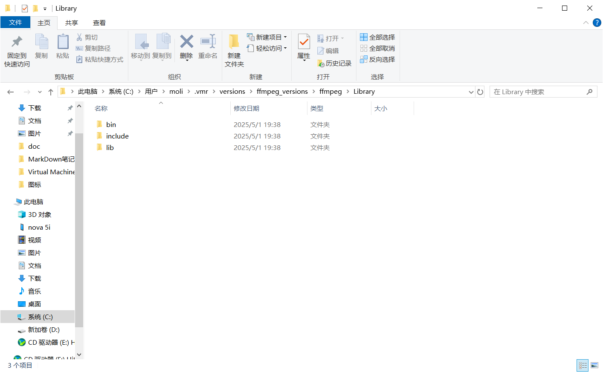
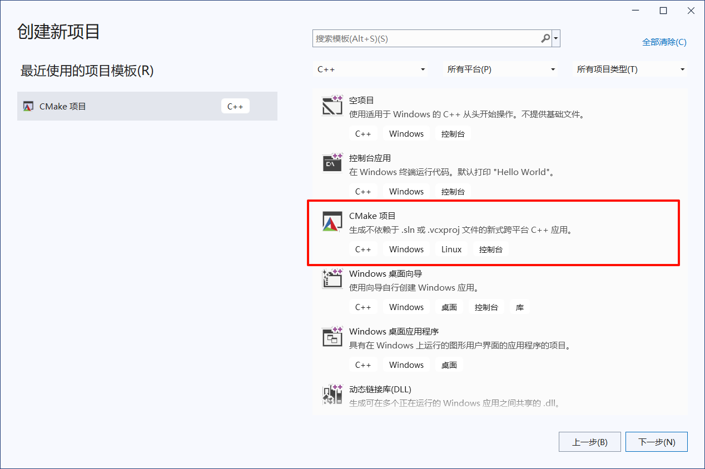
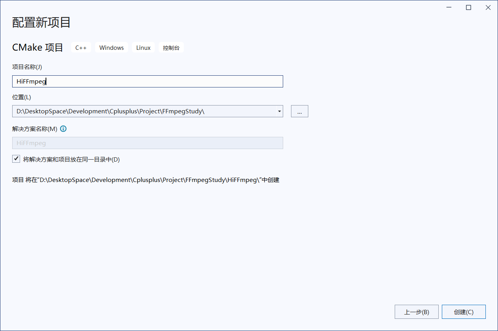
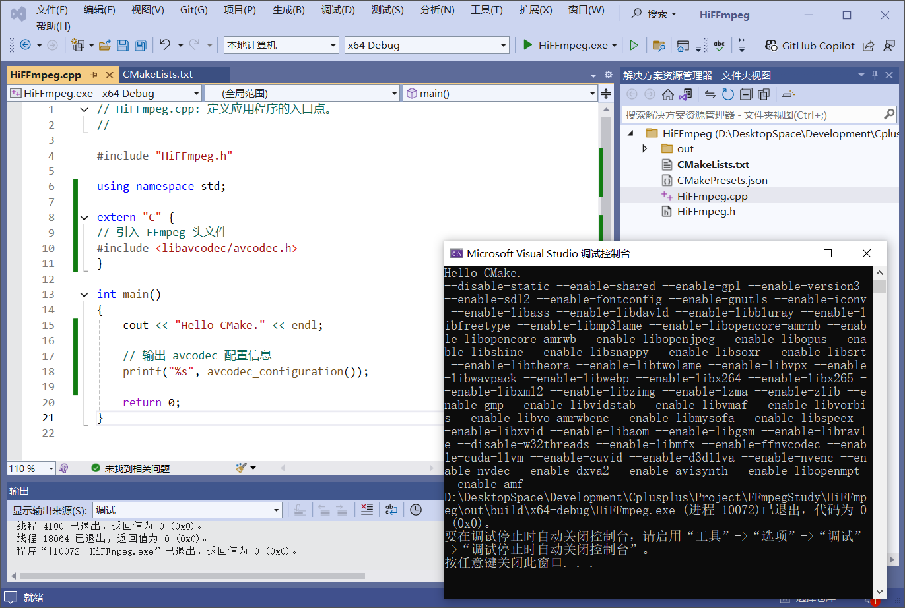

## Windows上使用Visual Studio和CMake搭建FFmpeg C++环境

采用Visual Studio 2022和CMake搭建

1、下载并安装Visual Studio 2022，安装时勾选C++开发套件，下载地址：[https://visualstudio.microsoft.com/zh-hans/vs/](https://visualstudio.microsoft.com/zh-hans/vs/)

2、下载FFmpeg（带shared或dev的），下载地址:[https://ffmpeg.org/download.html](https://ffmpeg.org/download.html)

自动构建下载地址：[https://github.com/BtbN/FFmpeg-Builds/releases?page=1](https://github.com/BtbN/FFmpeg-Builds/releases?page=1)

我下载的是ffmpeg4.4 shared。ffmpeg4.4体积小，功能对于我来说已经够用了，当然你可以选择最新的7.1，需要有include和lib目录。



3、VS创建CMake项目






4、编写CMake，配置FFmpeg

```cmake
# CMakeList.txt: HiFFmpeg 的 CMake 项目，在此处包括源代码并定义
# 项目特定的逻辑。
#
cmake_minimum_required (VERSION 3.8)

# 如果支持，请为 MSVC 编译器启用热重载。
if (POLICY CMP0141)
  cmake_policy(SET CMP0141 NEW)
  set(CMAKE_MSVC_DEBUG_INFORMATION_FORMAT "$<IF:$<AND:$<C_COMPILER_ID:MSVC>,$<CXX_COMPILER_ID:MSVC>>,$<$<CONFIG:Debug,RelWithDebInfo>:EditAndContinue>,$<$<CONFIG:Debug,RelWithDebInfo>:ProgramDatabase>>")
endif()

project ("HiFFmpeg")

# 指定 FFmpeg 安装目录，并将目录赋值给 FFMPEG_DEV_ROOT 变量，方便后续指令引用
set(FFMPEG_DEV_ROOT C:/Users/moli/.vmr/versions/ffmpeg_versions/ffmpeg/Library)

# 设置 FFmpeg 环境变量
# 指定 FFmpeg 头文件目录
include_directories(${FFMPEG_DEV_ROOT}/include)
# 指定链接器查找库文件  FFmpeg
link_directories(${FFMPEG_DEV_ROOT}/lib)
# 指定需要连接到程序中的库列表
link_libraries(
        avcodec
        avformat
        avfilter
        avdevice
        swresample
        swscale
        avutil
)

# 将源代码添加到此项目的可执行文件。
add_executable (HiFFmpeg "HiFFmpeg.cpp" "HiFFmpeg.h")

# 设置 CMake 构建目录
# 指定存放程序生成的静态库的目录
set(CMAKE_ARCHIVE_OUTPUT_DIRECTORY ${CMAKE_BINARY_DIR}/lib)
# 指定存放程序生成的动态库的目录
set(CMAKE_LIBRARY_OUTPUT_DIRECTORY ${CMAKE_BINARY_DIR}/lib)
# 指定存放可执行软件的目录
set(CMAKE_RUNTIME_OUTPUT_DIRECTORY ${CMAKE_BINARY_DIR}/bin)

# 复制动态库 dll 文件
# 查询 FFmpeg 安装目录下所有的动态库列表，并赋值给 ffmpeg_shared_libries 变量
file(GLOB ffmpeg_shared_libries ${FFMPEG_DEV_ROOT}/bin/*dll)
# 将 FFmpeg 动态库复制到 CMake 构建目录，运行程序需要用到
file(COPY ${ffmpeg_shared_libries} DESTINATION ${CMAKE_RUNTIME_OUTPUT_DIRECTORY})


if (CMAKE_VERSION VERSION_GREATER 3.12)
  set_property(TARGET HiFFmpeg PROPERTY CXX_STANDARD 20)
endif()

# TODO: 如有需要，请添加测试并安装目标。
```

5、编写cpp文件打印ffmpeg配置信息

```cpp
// HiFFmpeg.cpp: 定义应用程序的入口点。
//

#include "HiFFmpeg.h"

using namespace std;

extern "C" {
// 引入 FFmpeg 头文件
#include <libavcodec/avcodec.h>
}

int main()
{
	cout << "Hello CMake." << endl;

	// 输出 avcodec 配置信息
	printf("%s", avcodec_configuration());

	return 0;
}
```

6、运行



参考：[https://zhangxt.top/2024/10/27/build-ffmpeg-dev-env-in-windows/](https://zhangxt.top/2024/10/27/build-ffmpeg-dev-env-in-windows/)
